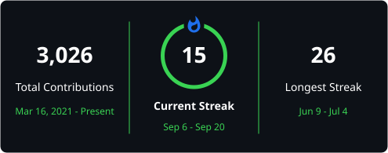

<h1 align="center">Hey, I'm Peanut</h1>

  27 · New Zealand · I run <a href="https://plvtc.com">Pean Logistics</a> and build the tools that keep it going

  
  
  
  
  
  
  

---

### Projects

**[Pean Logistics](https://plvtc.com)** is a [TruckersMP](https://truckersmp.com/vtc/64631) virtual trucking company. Most of my GitHub time goes into this stack.

<table>
  <tr>
    <td width="50%" valign="top">
      <h3><a href="https://plvtc.com">Website</a></h3>
      Public site, join flow, events, ranks, and gallery. 
      <a href="https://plvtc.com">plvtc.com</a>
    </td>
    <td width="50%" valign="top">
      <h3><a href="https://drivers.plvtc.com">Drivers Hub</a></h3>
      Driver portal for jobs, points, and company tools. 
      <a href="https://drivers.plvtc.com">drivers.plvtc.com</a>
    </td>
  </tr>
  <tr>
    <td width="50%" valign="top">
      <h3><a href="https://truckersmp.com/vtc/64631">TruckersMP VTC</a></h3>
      Pean Logistics on TruckersMP — convoy events and the public company page. 
      <a href="https://truckersmp.com/vtc/64631">truckersmp.com/vtc/64631</a>
    </td>
    <td width="50%" valign="top">
      <h3><a href="https://discord.gg/pean">Discord</a></h3>
      Community, applications, and the bot that runs ranks and tickets. 
      <a href="https://discord.gg/pean">discord.gg/pean</a>
    </td>
  </tr>
</table>

  
  &nbsp;
  

---

### Stack

  
  
  
  
  
  
  

---

### GitHub

  
  
   
  

  

